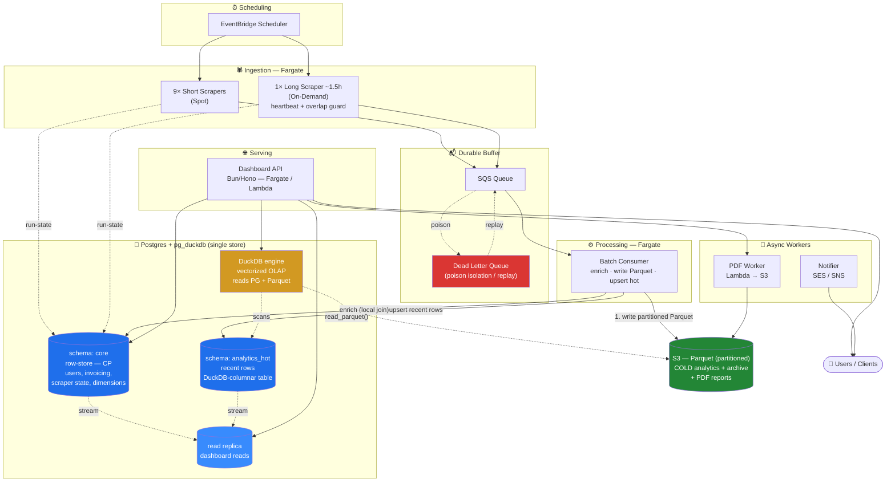
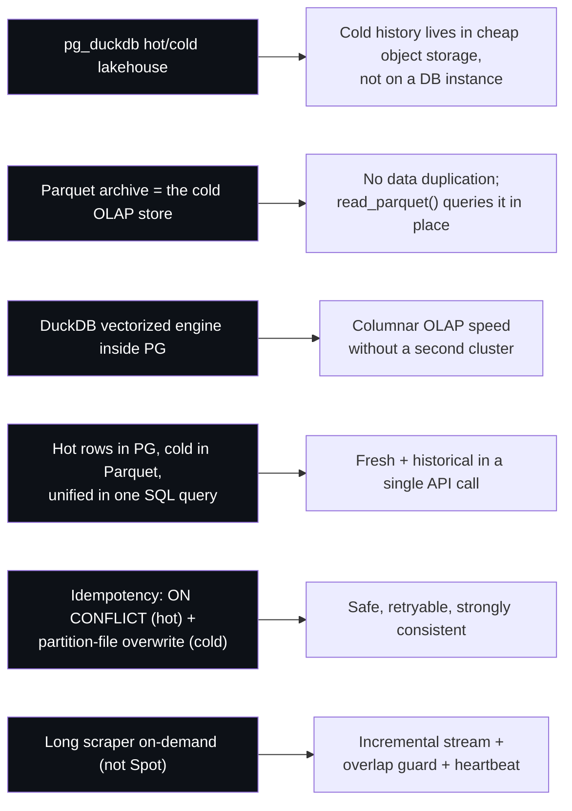
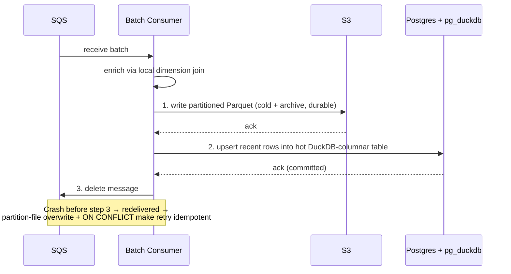
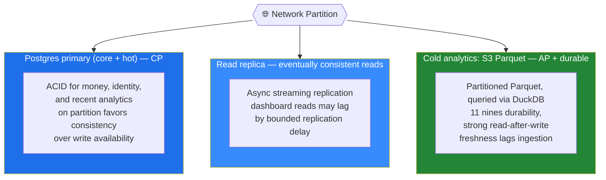
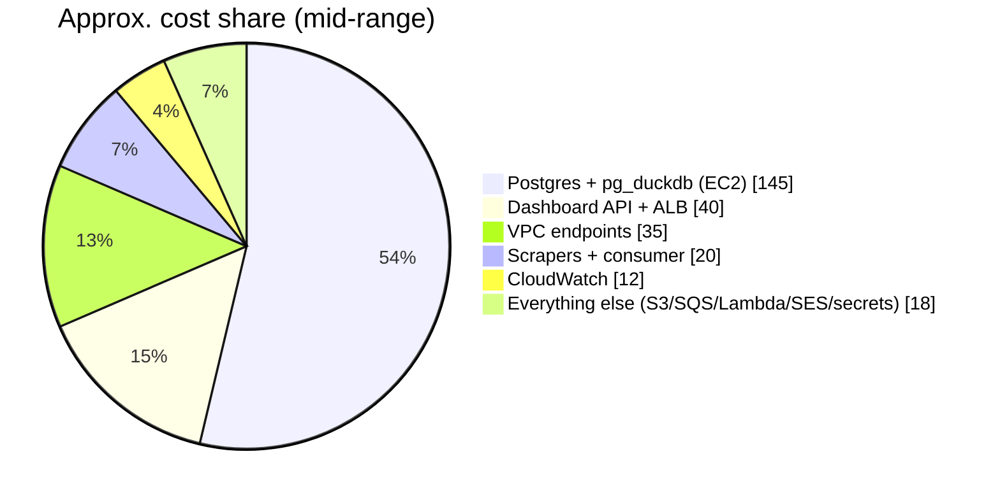
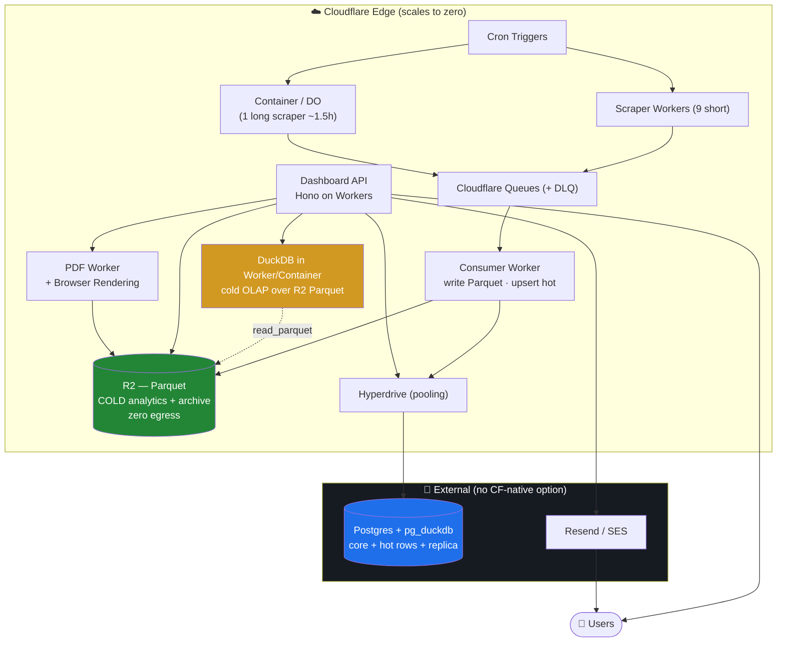

# MLS Platform — System Design

**Real-Estate Analytics & Reporting Platform**

A data-intensive platform ingesting **~100k records/day** from **10 MLS scrapers**. It runs on a **single Postgres core** with the **`pg_duckdb`** extension, giving a **hot/cold lakehouse**: transactional tables and recent ("hot") analytics live in Postgres for low-latency reads, while historical ("cold") analytics live as **Parquet in object storage** and are queried *in place* through DuckDB's vectorized columnar engine — no separate OLAP cluster.

> **Design change:** this revision uses **`pg_duckdb`** for OLAP instead of a dedicated columnar store (ClickHouse) or TimescaleDB hypertables. The key move: the **Parquet archive you already write becomes the cold-analytics store**, queried directly via `read_parquet('s3://…')`. Cold history sits in cheap object storage rather than on a database instance. See [§2](#2-key-architecture-decisions).

---

## 1. High-Level Design

### Data Flow

```
EventBridge → Scrapers (Fargate) → SQS (+ DLQ) → Batch consumer
        ├─ writes partitioned Parquet → S3   (cold analytics + archive)
        └─ upserts recent rows       → Postgres (hot analytics, DuckDB-columnar)
Dashboard API (pg_duckdb) → unifies hot PG rows + cold S3 Parquet → Users
```

### Architecture Diagram



### Components

| Component | Role |
|-----------|------|
| **Ingestion** | 10 Fargate scrapers (9 short on **Spot**, 1 long ~1.5h **on-demand**). Triggered by EventBridge Scheduler. Stream rows to SQS; report run-state to Postgres. |
| **Queue** | SQS + DLQ. Durable buffer; poison messages isolated for replay. |
| **Processing** | Batch consumer (Fargate). Enriches rows from dimensions (**local join** — same DB), writes **partitioned Parquet** to S3 (the cold-analytics store), and upserts **recent rows** into the hot analytics table. |
| **Data store** | **Postgres + `pg_duckdb`** (self-managed EC2 *or* a provider supporting it). `core` = transactional row tables; `analytics_hot` = recent rows in a **DuckDB-columnar** table; the **DuckDB engine** runs vectorized OLAP over both the hot table and **cold Parquet in S3**. **Read replica** serves dashboard reads. |
| **Cold analytics / Archive** | S3. **Partitioned Parquet doubles as the cold-analytics store** (`read_parquet`) *and* the verification/replay archive. Also holds generated PDF reports. |
| **Serving** | Bun/Hono Dashboard API. Through `pg_duckdb`, a single SQL query **unifies hot PG rows + cold S3 Parquet** (e.g. `UNION`/pushdown). Reads off the replica. |
| **Async** | PDF worker (Lambda → S3); Notifier (SES/SNS) for client reminders. |
| **Ops** | Secrets Manager; VPC endpoints (no NAT); CloudWatch alarms (DLQ depth, replication lag, Parquet write lag). **No cross-store reconciliation** — Parquet is the single cold source of truth. |

---

## 2. Key Architecture Decisions



- **Lakehouse, not a second database.** `pg_duckdb` embeds DuckDB's columnar engine in Postgres, so analytics queries get vectorized OLAP performance while **cold history stays as Parquet in object storage** — pennies per GB, no DB instance sized to hold years of data.
- **The Parquet archive *is* the cold-analytics store.** The same partitioned Parquet written for verification/replay is queried directly with `read_parquet('s3://…')`. One copy of cold data, no ClickHouse/Timescale replica of it, no reconciliation job.
- **Hot/cold split, unified at query time.** Recent rows live in a `pg_duckdb` columnar table for low-latency reads; older rows are scanned from Parquet on demand. A single SQL query `UNION`s the two, so the API sees "fresh + historical" transparently.
- **Idempotent ingestion.** Hot table: `ON CONFLICT (mls_id, listing_version) DO UPDATE`. Cold Parquet: deterministic partition paths (e.g. `dt=…/scraper=…/part.parquet`) so a replay **overwrites the partition file** — safely retryable and strongly consistent, no merge step.
- **Dashboards read off a replica** — analytical scans of the hot table stay off the CP primary; cold scans stream from object storage and don't touch the primary at all.
- **Long scraper runs on-demand (not Spot)** — streams incrementally, with an overlap guard and heartbeat.

### Dual-Write Sequence



> **Hosting note:** stock RDS/Aurora **cannot** load `pg_duckdb` (locked extension allowlist). This design runs Postgres **self-managed on EC2** or on a **provider that supports it** (e.g. Crunchy Bridge, or DuckDB-managed storage via **MotherDuck**). If vanilla RDS/Aurora is mandatory, fall back to **native partitioning + materialized views**, or run DuckDB as a **sidecar** querying the S3 Parquet directly (outside Postgres).

---

## 3. CAP Theorem

The system is **predominantly CP** — one Postgres source of truth — with cold analytics served from **durable, highly-available object storage**. Eventual consistency is limited to a few bounded surfaces.



| Surface | Choice | Rationale |
|---------|--------|-----------|
| **Postgres primary (core + hot analytics)** | **CP** | ACID for money, identity, and recent analytics. On partition the single primary favors consistency over write availability. |
| **Read replica (dashboard reads)** | **AP-on-reads** | Async streaming replication; reads stay available under primary stress but may lag by a bounded delay (seconds). |
| **Cold analytics — S3 Parquet (DuckDB)** | **AP + durable** | Highly available, strong read-after-write, 11 nines durability. Cold data is only as fresh as the last consumer write; the DuckDB engine is stateless compute. |

**Net:** one **CP system of record** for transactions and hot data, plus a **durable object-storage lakehouse** for cold analytics. Eventual consistency is confined to (a) ingestion lag, (b) read-replica lag — and cold-data freshness, which is acceptable by design.

---

## 4. Cost Estimate

Sized for the **target operating point**:

- **10–50 concurrent dashboard users**
- **Scrapers run once per day**, ingesting **10k–50k records/day** (~3.6M–18M rows/year)

> **Assumptions:** AWS `us-east-1`, on-demand pricing (no Reserved Instances / Savings Plans), Postgres + `pg_duckdb` **self-managed on EC2** with an **optional read replica**, Dashboard API on **Fargate behind an ALB** with 2 small tasks. All figures are USD/month and rounded.

### Monthly cost by component

| Component | Compute / config | Low | High | Notes |
|-----------|------------------|----:|-----:|-------|
| **Scrapers — Fargate** | 9× short on **Spot** + 1× long ~1.5h **On-Demand**, once/day | $5 | $15 | Runs minutes–hours/day, not 24/7. Spot makes the 9 short ones nearly free. |
| **Batch consumer — Fargate** | small task, processes daily batch | $5 | $20 | 10–50k records is tiny; cost is "time running," not volume. |
| **Dashboard API — Fargate + ALB** | 2× ~0.5 vCPU/1GB tasks, always-on, + ALB | $20 | $60 | ALB ~$16–20 is most of the floor. 10–50 users is light load. |
| **Postgres + `pg_duckdb` — EC2** | 1× `m6i.large`→`m6i.xlarge` primary (+ optional replica) + small EBS | $90 | $200 | **Biggest line — but smaller than a full-history DB.** Cold data is in S3, so the box only holds transactional + hot rows. See [sizing](#postgres--pg_duckdb-sizing). |
| **S3 — Parquet (cold analytics + archive) + PDFs** | partitioned Parquet doubles as OLAP store | $1 | $8 | A few GB/year compressed. This *is* the analytics store now — and it's still pennies. |
| **SQS + DLQ** | 0.3M–1.5M msgs/month | $0 | $2 | First 1M requests/month free; effectively free here. |
| **Lambda** | PDF worker + Notifier triggers | $1 | $5 | Low invocation count; often within free tier. |
| **SES / SNS** | client reminder emails / SMS | $1 | $10 | Email ~$0.10/1k; SMS is the variable. |
| **EventBridge Scheduler** | ~10 triggers/day | $0 | $1 | Negligible. |
| **Secrets Manager** | ~5–10 secrets | $2 | $5 | $0.40/secret/month + API calls. |
| **VPC interface endpoints** | ECR, SQS, Secrets, CloudWatch… (no NAT) | $15 | $70 | ~$7.3/endpoint/AZ. The deliberate trade vs a NAT Gateway. Single-AZ halves it. |
| **CloudWatch** | logs, metrics, alarms (DLQ depth, replication lag, Parquet write lag) | $5 | $20 | Scales with log retention/verbosity. |
| **Data transfer** | egress to users (dashboard, PDFs) | $1 | $10 | Mostly internal/in-AZ; user egress modest. |
| **Total** | | **≈ $145** | **≈ $425** | Realistic mid-point **≈ $230–340/month**. |

> **vs TimescaleDB/ClickHouse:** the lakehouse pattern is **cheaper** because **years of cold history live in S3 (pennies/GB), not on a DB instance** sized to hold it all. The Postgres box only carries transactional + hot data, so it can be smaller — and the Parquet you already archive does double duty as the OLAP store at no extra storage cost.

### Reading the numbers



- **The bill is "a (smaller) database + always-on edges."** Because cold history lives in object storage, the DB instance shrinks vs the Timescale/ClickHouse designs — the single biggest lever on cost.
- **S3 is doing double duty for ~$0.** The Parquet archive you write for replay *is* the OLAP store; you query it in place, paying only for the scans (and storage you were already paying for).
- **VPC interface endpoints remain a quiet line item** (~$15–70) — the cost of the "no NAT" decision.

### Postgres + `pg_duckdb` sizing

The instance holds **transactional core + hot recent rows** and runs the **DuckDB engine** (vectorized, memory-hungry during scans) — but it does **not** store cold history, so it can be modest. Favor RAM for the DuckDB execution. Pricing in `us-east-1`, on-demand, 730 hrs/month:

| Instance | vCPU / RAM | $/hr | Compute/mo | Role |
|----------|-----------|-----:|-----------:|------|
| `m6i.large` ⭐ | 2 / 8 GB | $0.096 | ~$70 | **Primary minimum** — txn + hot rows + light DuckDB scans |
| `m6i.xlarge` | 4 / 16 GB | $0.192 | ~$140 | Recommended — comfortable DuckDB OLAP + concurrency |
| `r6i.xlarge` | 4 / **32 GB** | $0.252 | ~$184 | Headroom for large cold-Parquet scans / many users |
| `m6i.large` (replica) | 2 / 8 GB | $0.096 | ~$70 | Read replica for dashboard reads (optional) |

Plus **EBS gp3** at $0.08/GB-month — small here (~50–100 GB), since cold history is in S3, not on disk: +$4–8.

**All-in:**

| Topology | Monthly (compute + EBS) |
|----------|------------------------:|
| Primary only (`m6i.large` + 50 GB) | **~$75** |
| Primary + read replica (`m6i.large` ×2) | **~$150** |
| Primary `m6i.xlarge` + replica | **~$215** |
| 1-yr Savings Plan (~37% off compute) | **−$25–80** off the above |

> **Why smaller than the Timescale design:** there, the DB stored *all* analytics history (so it scaled with data). Here it stores only hot rows; cold data lives in S3 and is scanned on demand — so the instance is sized for *query concurrency*, not *data volume*.

---

## 5. Alternative: Cloudflare Infrastructure

The `pg_duckdb` lakehouse ports to Cloudflare **better than the ClickHouse/Timescale designs did** — because its analytics store is just **Parquet files in object storage** and its engine is **embedded/ephemeral compute**. Both map cleanly onto **R2 (zero egress)** and **Workers/Containers**. The only piece without a Cloudflare-native home is the **transactional Postgres core**.

### Service mapping (AWS → Cloudflare)

| AWS component | Cloudflare equivalent | Fit |
|---------------|----------------------|-----|
| EventBridge Scheduler | **Cron Triggers** | ✅ Clean |
| Short scrapers (Fargate Spot) | **Workers** | ⚠️ ≤5 min CPU; fine for short scrapes |
| Long scraper ~1.5h | **Cloudflare Containers** (or chunked **DO** alarms) | ⚠️ Needs Containers / DO chunks |
| SQS + DLQ | **Cloudflare Queues** (built-in DLQ) | ✅ Clean |
| Batch consumer (Fargate) | **Workers** | ✅ Clean |
| Parquet archive / **cold analytics** | **R2** + **DuckDB in a Worker/Container** (`read_parquet('r2://…')`) | ✅ **Excellent** — zero-egress object storage + portable DuckDB compute |
| **Hot rows + transactional core** | External Postgres + `pg_duckdb` via **Hyperdrive**, *or* **D1** for txn only | ❌ No native Postgres; D1 (SQLite) has no `pg_duckdb` |
| Dashboard API (Bun/Hono) | **Workers** — Hono runs natively | ✅ Excellent — no rewrite |
| PDF worker (Lambda) | **Workers + Browser Rendering** | ✅ Clean |
| Notifier (SES/SNS) | **Email Routing** + external send (Resend/SES) | ⚠️ No native bulk send |
| Secrets Manager | **Workers Secrets / Secrets Store** | ✅ Clean |
| VPC endpoints / NAT | **N/A** — edge, no VPC | ✅ Cost eliminated |
| CloudWatch | **Workers Analytics + Logpush** | ✅ Clean |

### Architecture on Cloudflare



### Cost comparison

Two Cloudflare variants, same workload (10–50 users, once-daily ingest of 10–50k records). All USD/month.

| Component | AWS (from §4) | **CF-native** (DuckDB-over-R2 + D1) | **CF + external Postgres** (faithful) |
|-----------|--------------:|------------------------------------:|--------------------------------------:|
| Compute (API + scrapers + consumer + PDF) | $30–95 | **$5** Workers Paid base¹ | **$5** Workers Paid base¹ |
| Long-scraper runtime | (in above) | $5–15 Containers | $5–15 Containers |
| Cold-analytics compute (DuckDB) | (in DB) | $0–10 DuckDB in Worker/Container | (in external PG) |
| Queue | $0–2 | $0–1 Queues | $0–1 Queues |
| **Object storage = cold analytics** | $1–8 | $1–3 R2 (zero egress) | $1–3 R2 (zero egress) |
| **Transactional + hot store** | $90–200 PG+pg_duckdb | $0–10 D1 ⚠️ hot/txn only, SQLite | $90–300 external PG + pg_duckdb + Hyperdrive (free) |
| Email | $1–10 | $0–20 Resend/SES | $0–20 Resend/SES |
| Secrets / observability | $7–25 | $0–3 (mostly included) | $0–3 (mostly included) |
| VPC endpoints / NAT / ALB | $35–130 | **$0** | **$0** |
| **Total** | **≈ $230–340** | **≈ $15–55/month** | **≈ $110–340/month** |

¹ Workers Paid is $5/mo and includes 10M requests + 30M CPU-ms — far above this workload, so all Worker-based components share that one base fee.

### Trade-offs

**Where Cloudflare wins (more than before)**
- **Cold analytics is genuinely CF-native here.** DuckDB reading **Parquet from R2** is portable compute over object storage — exactly Cloudflare's strength, and **R2's zero egress** is ideal for repeated cold scans. The OLAP path ports cleanly; only the transactional core stays external.
- **No VPC/NAT/endpoint/ALB tax** ($35–130/mo of pure plumbing gone).
- **Hono runs unchanged on Workers**; the edge tier scales to zero.

**Where Cloudflare still hurts**
- **The transactional + hot store has no native home.** It's external Postgres + `pg_duckdb` via Hyperdrive, *or* **D1** (SQLite) — which can hold transactional + hot rows but **can't run `pg_duckdb`** (DuckDB-over-R2 must then live in a separate Worker/Container, splitting the engine from the hot table).
- **Long-running scrapers fight the Workers model** — Containers or DO-alarm chunks, with heartbeat/overlap-guard rebuilt.
- **CF-native (D1) splits the lakehouse:** hot rows in D1, cold OLAP in DuckDB-over-R2 — workable and cheap, but the unified "one SQL query spans hot + cold" property of `pg_duckdb` is lost (you join in application code instead).

### Verdict

- **This is the most Cloudflare-friendly of the three designs.** Because the cold-analytics store is *just Parquet in R2* and the engine is *embedded DuckDB compute*, the analytics half ports natively — and R2 zero-egress actively favors it. Run **ingest + serving + cold OLAP on Cloudflare** and keep only the **transactional + hot Postgres** external (~$110–340/mo).
- **The CF-native path (~$15–55, D1 + DuckDB-over-R2) is now actually viable**, not a downgrade like it was with TimescaleDB — you keep real columnar OLAP (DuckDB over R2 Parquet) and only trade the unified hot+cold query and Postgres semantics for D1. Fine if the transactional core is simple.
- **Net:** `pg_duckdb`'s lakehouse is the **most portable** architecture across AWS *and* Cloudflare — the analytics store is files in object storage and the engine is ephemeral compute, both of which run anywhere. The only "heavy," platform-bound piece left is the transactional Postgres core.

> **Pricing note:** Cloudflare figures use public list pricing (Workers Paid $5/mo base, Queues ~$0.40/M ops, R2 $0.015/GB + $0 egress, D1 within included tiers at this volume). Containers, Browser Rendering, and DuckDB compute bill per resource-second/request and are estimated at low daily usage. External Postgres/email are third-party list prices.
