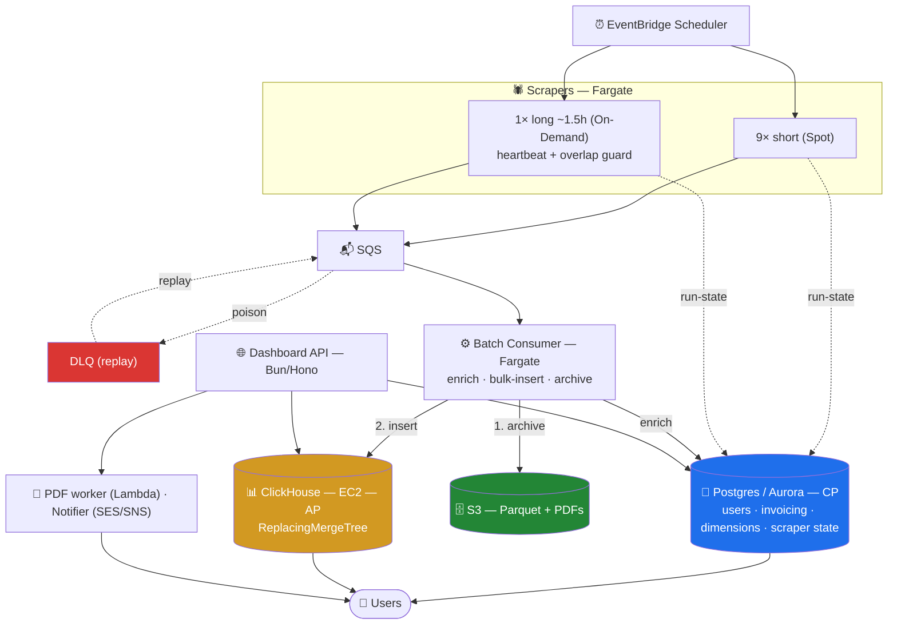
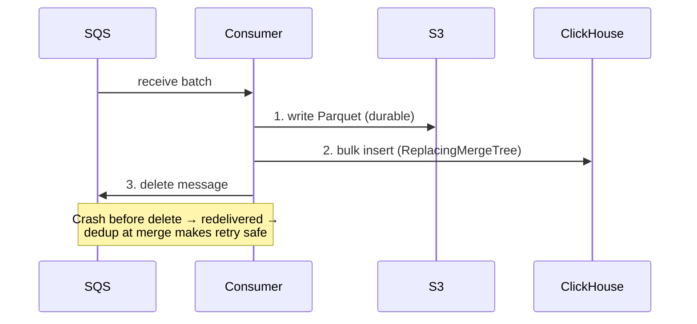

# MLS Platform — System Design

**Real-Estate Analytics & Reporting Platform**

Data-intensive platform ingesting **~100k records/day** from **10 MLS scrapers**. Deliberately split into a **strongly-consistent transactional core** (Postgres) and an **availability-first analytics pipeline** (SQS → consumer → ClickHouse).

---

## 1. High-Level Design

**Data flow:** EventBridge → Scrapers (Fargate) → SQS (+ DLQ) → Batch consumer → ClickHouse + S3 (Parquet). Dashboard API reads Postgres + ClickHouse → Users.

| Component | Role |
|-----------|------|
| **Ingestion** | 10 Fargate scrapers (9 short on Spot, 1 long ~1.5h on-demand). Stream rows to SQS; report run-state to Postgres. |
| **Queue** | SQS + DLQ — durable buffer; poison messages isolated for replay. |
| **Processing** | Batch consumer (Fargate). Enriches from Postgres dimensions, bulk-inserts to ClickHouse, archives Parquet to S3. |
| **Transactional store** | Postgres (RDS/Aurora) — users, invoicing, dimensions, scraper state. |
| **Analytics store** | ClickHouse (self-hosted EC2) — hot query store; ReplacingMergeTree for dedup. |
| **Archive** | S3 — Parquet (verification + replay) and generated PDF reports. |
| **Serving** | Bun/Hono Dashboard API (Fargate or Lambda + RDS Proxy). Reads both stores. |
| **Async / Ops** | PDF worker (Lambda → S3); Notifier (SES/SNS). Secrets Manager; VPC endpoints (no NAT); CloudWatch alarms (DLQ depth, merge lag); Postgres↔ClickHouse count reconciliation. |

---

## 2. Key Decisions

- **Scrapers never insert into ClickHouse directly** — batched inserts via the consumer avoid the "too many parts" failure.
- **ReplacingMergeTree dedup** makes the pipeline idempotent and safely retryable.
- **Dual-write order: S3 → ClickHouse → delete SQS message** — a durable copy exists before anything can fail.
- **Long scraper on-demand (not Spot)** — streams incrementally, with an overlap guard and heartbeat.
- **ClickHouse is justified only by query latency** — at ~36M rows/year Postgres alone could serve analytics for years.

---

## 3. CAP Theorem

Two subsystems with deliberately opposite choices under partition.

| Subsystem | Choice | Rationale |
|-----------|--------|-----------|
| **Transactional core (Postgres)** | **CP** | ACID for money and identity; single primary favors consistency over write availability. |
| **Analytics pipeline (SQS → consumer → ClickHouse)** | **AP** | Prioritizes ingest throughput and read availability; dashboards may lag seconds–minutes, dedup resolves at merge. |
| **Object storage (S3)** | **AP + durable** | Highly available, strong read-after-write, 11 nines durability. |

**Net:** consistency where correctness is non-negotiable (invoicing, users); availability and eventual consistency where freshness can safely lag (analytics).

---

## 4. Cost Estimate

For **10–50 concurrent users** and scrapers running **once/day** ingesting **10–50k records/day** (~36M rows/year). AWS `us-east-1`, on-demand, USD/month.

| Component | Low | High | Notes |
|-----------|----:|-----:|-------|
| Scrapers — Fargate (Spot + On-Demand) | $5 | $15 | Runs minutes–hours/day, not 24/7. |
| Batch consumer — Fargate | $5 | $20 | Cost is "time running," not volume. |
| Dashboard API — Fargate + ALB | $20 | $60 | ALB (~$16–20) is most of the floor. |
| Postgres — RDS Multi-AZ | $50 | $120 | CP store; Multi-AZ ≈ 2× single instance. |
| **ClickHouse — EC2** | $125 | $145 | `c6i.xlarge` (4 vCPU/8 GB min spec) + ~150 GB gp3. Biggest line. |
| S3 (Parquet + PDFs) | $1 | $8 | A few GB/year compressed. |
| SQS + DLQ | $0 | $2 | First 1M req/month free. |
| Lambda (PDF + Notifier) | $1 | $5 | Often within free tier. |
| SES / SNS | $1 | $10 | SMS is the variable. |
| Secrets Manager | $2 | $5 | $0.40/secret/month. |
| VPC interface endpoints (no NAT) | $15 | $70 | ~$7.3/endpoint/AZ; single-AZ halves it. |
| CloudWatch + EventBridge + data transfer | $6 | $30 | Logs, alarms, user egress. |
| **Total** | **≈ $230** | **≈ $490** | Realistic mid-point **≈ $300–420/month**. |

**Key insight:** the bill is dominated by the three always-on components — **ClickHouse + Postgres + Dashboard API/ALB (~80%)** — which cost the same whether you ingest 10k or 50k records. Actual ingestion (scrapers, SQS, consumer, S3) is **under ~$30/month**.

**ClickHouse minimum spec — 4 vCPU / 8 GB:**

| Instance | $/hr | Compute/mo |
|----------|-----:|-----------:|
| `c6a.xlarge` (AMD) | $0.153 | ~$112 |
| `c6i.xlarge` (Intel) | $0.170 | ~$124 |
| `m6i.xlarge` (4/16, recommended for RAM headroom) | $0.192 | ~$140 |

\+ ~150 GB gp3 EBS (~$12) → **~$125–145/mo on-demand** (~$85–100 on a 1-yr Savings Plan).

**Levers:** Reserved/Savings Plans on RDS + ClickHouse (−30–40%); single-AZ VPC endpoints (−$8–35); defer ClickHouse and serve analytics from Postgres (−$125–145) until query latency demands it.

---

## 5. Cloudflare Alternative (brief)

Same architecture on Cloudflare's edge: serverless, scales to zero. Two stateful stores have no first-party equivalent and stay external.

| AWS | Cloudflare | Fit |
|-----|-----------|-----|
| EventBridge | Cron Triggers | ✅ |
| Scrapers / consumer | Workers (long scraper → Containers) | ⚠️ Workers cap CPU; long job needs Containers |
| SQS + DLQ | Queues | ✅ |
| S3 | R2 (zero egress) | ✅ Better |
| Dashboard API (Hono) | Workers | ✅ Runs unchanged |
| PDF / Notifier | Workers + Browser Rendering / Resend | ✅ |
| VPC endpoints / NAT | — (edge, no VPC) | ✅ Eliminated |
| **Postgres** | External (Neon/Supabase) via Hyperdrive, or D1 | ❌ No managed Postgres |
| **ClickHouse** | External (ClickHouse Cloud), or Analytics Engine | ❌ No managed columnar OLAP |

**Cost:** ~**$80–300/mo** keeping Postgres + ClickHouse external (CF for edge/ingest/serving), vs ~$300–420 on AWS.

**Verdict:** Cloudflare wins on the edge/compute tier (no VPC/NAT/ALB tax, R2 zero egress, Hono native) but can't host the strongly-consistent stores — so it's "Cloudflare for the edge, Postgres + ClickHouse elsewhere." AWS earns its premium only when you need those managed, always-on stores.
