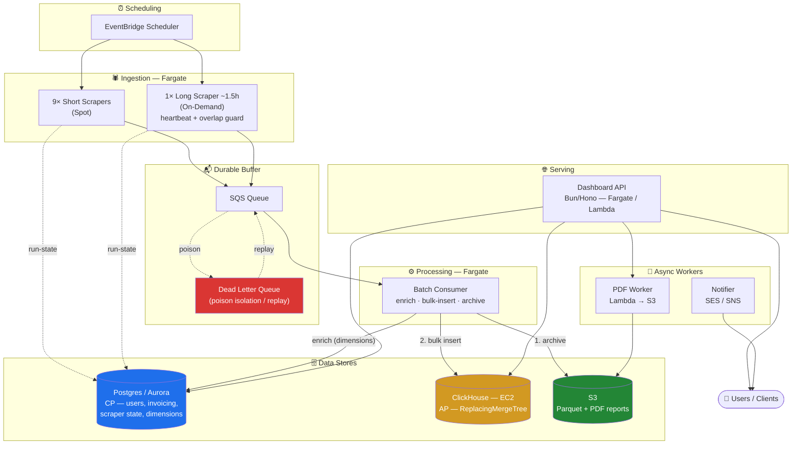
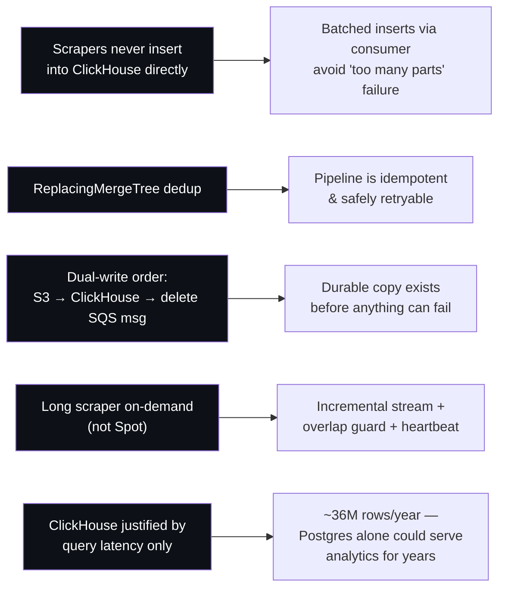
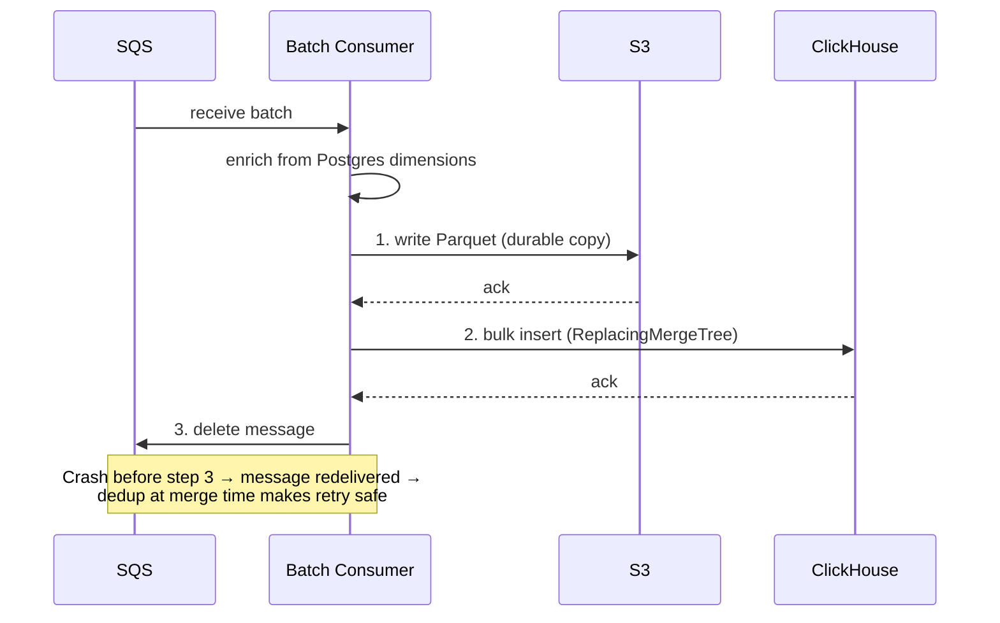
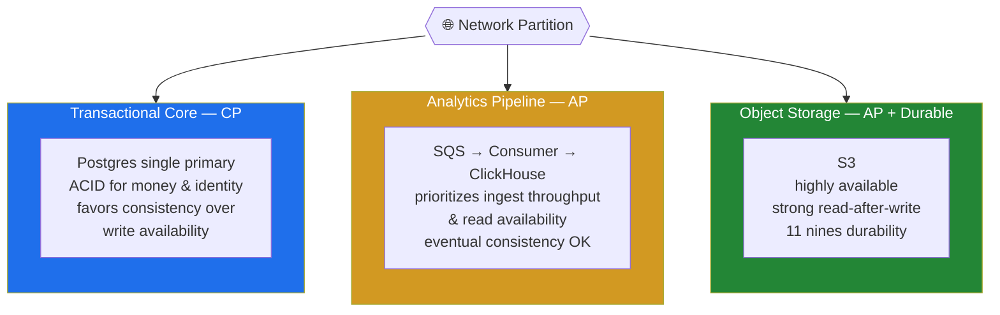
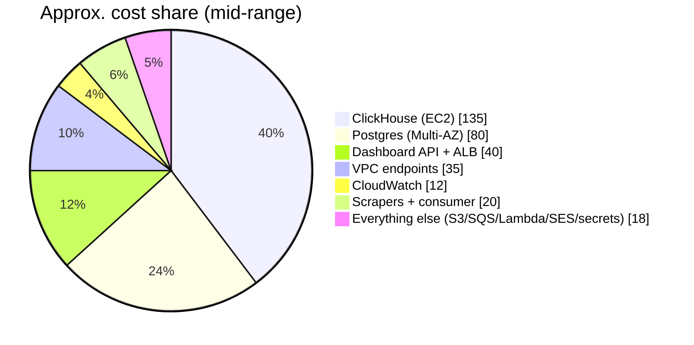

# MLS Platform — System Design

**Real-Estate Analytics & Reporting Platform**

A data-intensive platform ingesting **~100k records/day** from **10 MLS scrapers**. It is deliberately split into a **strongly-consistent transactional core** and an **availability-first analytics pipeline**.

---

## 1. High-Level Design

### Data Flow

```
EventBridge → Scrapers (Fargate) → SQS (+ DLQ) → Batch consumer → ClickHouse + S3 (Parquet)
Dashboard API → reads Postgres + ClickHouse → Users
```

### Architecture Diagram



### Components

| Component | Role |
|-----------|------|
| **Ingestion** | 10 Fargate scrapers (9 short on **Spot**, 1 long ~1.5h **on-demand**). Triggered by EventBridge Scheduler. Stream rows to SQS; report run-state to Postgres. |
| **Queue** | SQS + DLQ. Durable buffer; poison messages isolated for replay. |
| **Processing** | Batch consumer (Fargate). Enriches rows from Postgres dimensions, bulk-inserts to ClickHouse, archives Parquet to S3. |
| **Transactional store** | Postgres (RDS/Aurora). Users, properties, invoicing, scraper state, dimension data. |
| **Analytics store** | ClickHouse (self-hosted EC2). Hot query store; `ReplacingMergeTree` for dedup. |
| **Archive** | S3. Parquet (verification + replay) and generated PDF reports. |
| **Serving** | Bun/Hono Dashboard API (Fargate, or Lambda + RDS Proxy). Reads both stores. |
| **Async** | PDF worker (Lambda → S3); Notifier (SES/SNS) for client reminders. |
| **Ops** | Secrets Manager; VPC endpoints (no NAT); CloudWatch alarms (DLQ depth, merge lag); Postgres↔ClickHouse count reconciliation. |

---

## 2. Key Architecture Decisions



- **Scrapers never insert into ClickHouse directly** — batched inserts via the consumer avoid the *"too many parts"* failure.
- **`ReplacingMergeTree` dedup** makes the whole pipeline idempotent and safely retryable.
- **Dual-write order: S3 → ClickHouse → delete SQS message** — a durable copy exists before anything can fail.
- **Long scraper runs on-demand (not Spot)** — streams incrementally, with an overlap guard and heartbeat.
- **ClickHouse is justified only by query latency** — at ~36M rows/year Postgres alone could serve analytics for years.

### Dual-Write Sequence



---

## 3. CAP Theorem

Under a network partition you choose **Consistency OR Availability**. This system runs two subsystems with deliberately opposite choices.



| Subsystem | Choice | Rationale |
|-----------|--------|-----------|
| **Transactional core (Postgres)** | **CP** | ACID for money and identity; on partition the single primary favors consistency over write availability. |
| **Analytics pipeline (SQS → consumer → ClickHouse)** | **AP** | Prioritizes ingest throughput and read availability; eventual consistency is acceptable (dashboards may lag seconds to minutes; dedup resolves at merge time). |
| **Object storage (S3)** | **AP + Durable** | Highly available, strong read-after-write, 11 nines durability. |

**Net:** consistency where correctness is non-negotiable (invoicing, users), availability and eventual consistency where freshness can safely lag (analytics).

---

## 4. Cost Estimate

Sized for the **target operating point**:

- **10–50 concurrent dashboard users**
- **Scrapers run once per day**, ingesting **10k–50k records/day** (~3.6M–18M rows/year)

> **Assumptions:** AWS `us-east-1`, on-demand pricing (no Reserved Instances or Savings Plans), Postgres **Multi-AZ** (it's the CP money/identity store), ClickHouse a **single EC2 node**, Dashboard API on **Fargate behind an ALB** with 2 small tasks. All figures are USD/month and rounded.

### Monthly cost by component

| Component | Compute / config | Low | High | Notes |
|-----------|------------------|----:|-----:|-------|
| **Scrapers — Fargate** | 9× short on **Spot** + 1× long ~1.5h **On-Demand**, once/day | $5 | $15 | Runs minutes–hours/day, not 24/7. Spot makes the 9 short ones nearly free. |
| **Batch consumer — Fargate** | small task, processes daily batch | $5 | $20 | 10–50k records is tiny; cost is "time running," not volume. |
| **Dashboard API — Fargate + ALB** | 2× ~0.5 vCPU/1GB tasks, always-on, + ALB | $20 | $60 | ALB ~$16–20 is most of the floor. 10–50 users is light load. |
| **Postgres — RDS Multi-AZ** | `db.t4g.small`→`medium`, + storage/backups | $50 | $120 | CP store; Multi-AZ ≈ 2× a single instance. Aurora Serverless v2 (min 0.5 ACU) lands in the same band. |
| **ClickHouse — EC2** | 1× `c6i.xlarge` (4 vCPU/8 GB, min spec) → `m6i.xlarge` (4 vCPU/16 GB) + ~150 GB gp3 EBS | $125 | $145 | The single biggest line. Always-on. See [ClickHouse sizing](#clickhouse-ec2-sizing) below. A replica for HA roughly doubles this. |
| **S3** | Parquet archive + PDFs | $1 | $8 | A few GB/year compressed. Storage + requests are trivial at this volume. |
| **SQS + DLQ** | 0.3M–1.5M msgs/month | $0 | $2 | First 1M requests/month free; effectively free here. |
| **Lambda** | PDF worker + Notifier triggers | $1 | $5 | Low invocation count; often within free tier. |
| **SES / SNS** | client reminder emails / SMS | $1 | $10 | Email ~$0.10/1k; SMS is the variable — depends on volume/region. |
| **EventBridge Scheduler** | ~10 triggers/day | $0 | $1 | Negligible. |
| **Secrets Manager** | ~5–10 secrets | $2 | $5 | $0.40/secret/month + API calls. |
| **VPC interface endpoints** | ECR, SQS, Secrets, CloudWatch… (no NAT) | $15 | $70 | ~$7.3/endpoint/AZ. Real cost — but the deliberate trade vs a NAT Gateway (~$32+/mo + data). S3/DynamoDB gateway endpoints are free. Single-AZ halves it. |
| **CloudWatch** | logs, metrics, alarms (DLQ depth, merge lag) | $5 | $20 | Scales with log retention/verbosity. |
| **Data transfer** | egress to users (dashboard, PDFs) | $1 | $10 | Mostly internal/in-AZ; user egress is modest. |
| **Total** | | **≈ $230** | **≈ $495** | Realistic mid-point **≈ $300–420/month**. |

### Reading the numbers



- **The workload is small; the bill is "always-on infrastructure," not data.** ~80% of cost is the three persistent components — **ClickHouse + Postgres + the Dashboard API/ALB** — all of which cost the same whether you ingest 10k or 50k records. The actual ingestion (scrapers, SQS, consumer, S3) is **under ~$30/month combined**.
- **This reinforces decision §2:** at this scale "Postgres alone could serve analytics for years." Dropping the ClickHouse EC2 node would cut the bill by roughly **a third** — ClickHouse is a query-latency investment, not a capacity one yet.
- **VPC interface endpoints are a quiet line item** (~$15–70). They're the cost of the "no NAT" decision; at low data-egress volume the trade is roughly break-even with a NAT Gateway, and you gain the security posture.

### ClickHouse EC2 sizing

**Minimum spec: 4 vCPU / 8 GB RAM** — handles lightweight analytics with basic aggregations. That's the compute-optimized (1:2 vCPU:RAM) `xlarge` class. Pricing in `us-east-1`, on-demand, 730 hrs/month:

| Instance | vCPU / RAM | $/hr | Compute/mo | Notes |
|----------|-----------|-----:|-----------:|-------|
| `c6a.xlarge` (AMD) | 4 / 8 GB | $0.1531 | **~$112** | Cheapest exact match for the min spec |
| `c6i.xlarge` (Intel) | 4 / 8 GB | $0.170 | **~$124** | Common default |
| `c7i.xlarge` (Intel, newest) | 4 / 8 GB | $0.1785 | **~$130** | Best perf/$ on current gen |
| `m6i.xlarge` (general) | 4 / **16 GB** | $0.192 | **~$140** | **Recommended** — same vCPU, 2× RAM for only ~$15/mo more |
| `t3.xlarge` (burstable) | 4 / 16 GB | $0.1664 | ~$121 | Avoid — burstable CPU stalls under steady CH load |

Plus required **EBS gp3** data volume at $0.08/GB-month: 100 GB → +$8, 200 GB → +$16.

**All-in (compute + ~150 GB EBS):**

| Pricing | Monthly |
|---------|--------:|
| On-Demand | **~$125–145** |
| 1-yr Savings Plan (~37% off) | ~$85–100 |
| 3-yr Savings Plan (~60% off) | ~$60–75 |

> **Sizing caveat:** 4 vCPU / **8 GB** satisfies the stated minimum, but ClickHouse is memory-hungry — large aggregations, JOINs, and background merges consume RAM and will spill to disk (slower) or OOM when 8 GB runs short. For headroom, prefer **`m6i.xlarge` (4 vCPU / 16 GB)** — same core count, double the RAM, only ~$15/mo more. The cost line above brackets `c6i.xlarge` (8 GB floor) → `m6i.xlarge` (16 GB recommended).

### Levers if you need to trim

| Lever | Approx. saving | Trade-off |
|-------|----------------|-----------|
| Reserved Instances / Savings Plans on RDS + ClickHouse EC2 | **−30–40%** on those lines (~$50–100/mo) | 1–3yr commitment |
| Drop Postgres to single-AZ | **−$25–60/mo** | loses HA on the CP store — **not recommended** |
| Move Dashboard API to **Lambda + RDS Proxy** | **−$10–30/mo** if traffic is bursty | RDS Proxy floor ~$11/mo; cold starts |
| Single-AZ VPC endpoints | **−$8–35/mo** | reduced endpoint AZ-redundancy |
| Defer ClickHouse, serve analytics from Postgres | **−$70–150/mo** | revisit once query latency actually demands a columnar store |

> **Excluded:** one-time setup/data-migration, developer/CI environments, support plans, and any third-party MLS/data-source licensing. A non-prod (single-AZ, no replicas, Spot-heavy) copy of this stack typically runs **~40–50% of prod**.
