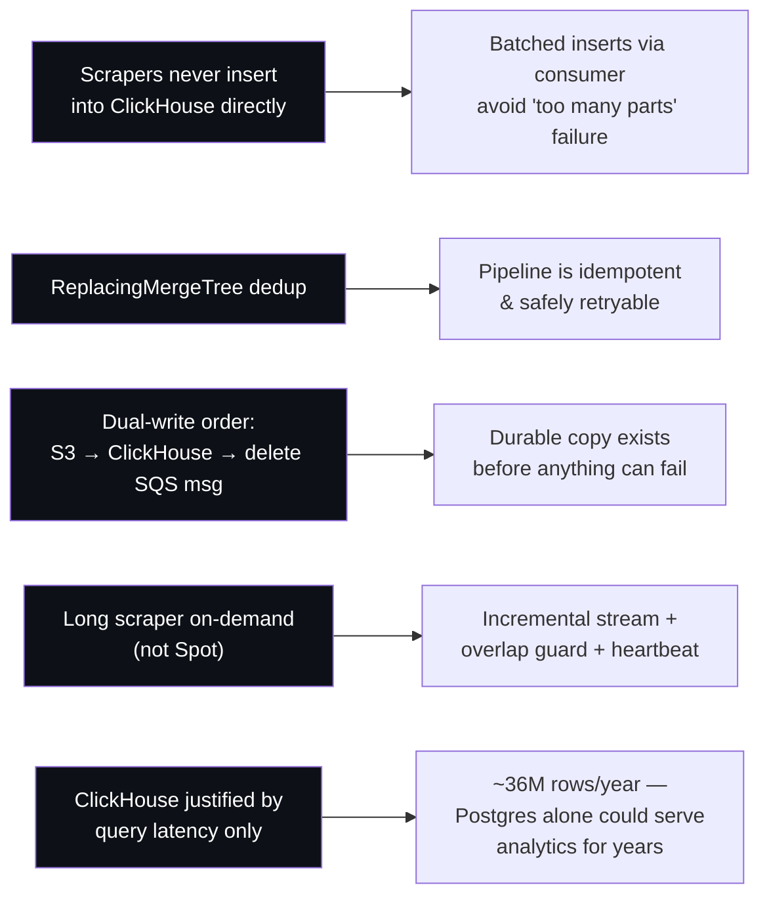
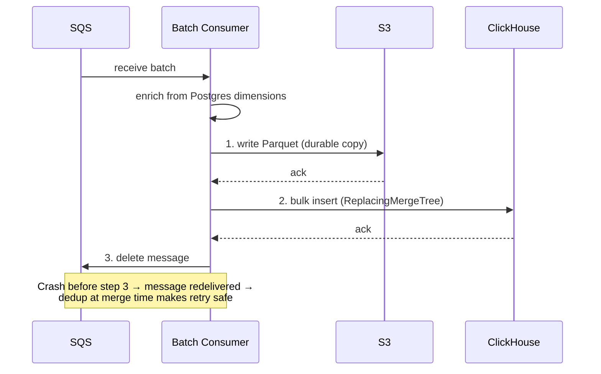
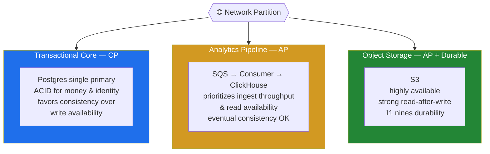

# MLS Platform — System Design

**Real-Estate Analytics & Reporting Platform**

A data-intensive platform ingesting **~100k records/day** from **10 MLS scrapers**. It is deliberately split into a **strongly-consistent transactional core** and an **availability-first analytics pipeline**.

---

## 1. High-Level Design

### Data Flow

```
EventBridge → Scrapers (Fargate) → SQS (+ DLQ) → Batch consumer → ClickHouse + S3 (Parquet)
Dashboard API → reads Postgres + ClickHouse → Users
```

### Architecture Diagram


### Components

| Component | Role |
|-----------|------|
| **Ingestion** | 10 Fargate scrapers (9 short on **Spot**, 1 long ~1.5h **on-demand**). Triggered by EventBridge Scheduler. Stream rows to SQS; report run-state to Postgres. |
| **Queue** | SQS + DLQ. Durable buffer; poison messages isolated for replay. |
| **Processing** | Batch consumer (Fargate). Enriches rows from Postgres dimensions, bulk-inserts to ClickHouse, archives Parquet to S3. |
| **Transactional store** | Postgres (RDS/Aurora). Users, properties, invoicing, scraper state, dimension data. |
| **Analytics store** | ClickHouse (self-hosted EC2). Hot query store; `ReplacingMergeTree` for dedup. |
| **Archive** | S3. Parquet (verification + replay) and generated PDF reports. |
| **Serving** | Bun/Hono Dashboard API (Fargate, or Lambda + RDS Proxy). Reads both stores. |
| **Async** | PDF worker (Lambda → S3); Notifier (SES/SNS) for client reminders. |
| **Ops** | Secrets Manager; VPC endpoints (no NAT); CloudWatch alarms (DLQ depth, merge lag); Postgres↔ClickHouse count reconciliation. |

---

## 2. Key Architecture Decisions



- **Scrapers never insert into ClickHouse directly** — batched inserts via the consumer avoid the *"too many parts"* failure.
- **`ReplacingMergeTree` dedup** makes the whole pipeline idempotent and safely retryable.
- **Dual-write order: S3 → ClickHouse → delete SQS message** — a durable copy exists before anything can fail.
- **Long scraper runs on-demand (not Spot)** — streams incrementally, with an overlap guard and heartbeat.
- **ClickHouse is justified only by query latency** — at ~36M rows/year Postgres alone could serve analytics for years.

### Dual-Write Sequence



---

## 3. CAP Theorem

Under a network partition you choose **Consistency OR Availability**. This system runs two subsystems with deliberately opposite choices.



| Subsystem | Choice | Rationale |
|-----------|--------|-----------|
| **Transactional core (Postgres)** | **CP** | ACID for money and identity; on partition the single primary favors consistency over write availability. |
| **Analytics pipeline (SQS → consumer → ClickHouse)** | **AP** | Prioritizes ingest throughput and read availability; eventual consistency is acceptable (dashboards may lag seconds to minutes; dedup resolves at merge time). |
| **Object storage (S3)** | **AP + Durable** | Highly available, strong read-after-write, 11 nines durability. |

**Net:** consistency where correctness is non-negotiable (invoicing, users), availability and eventual consistency where freshness can safely lag (analytics).
