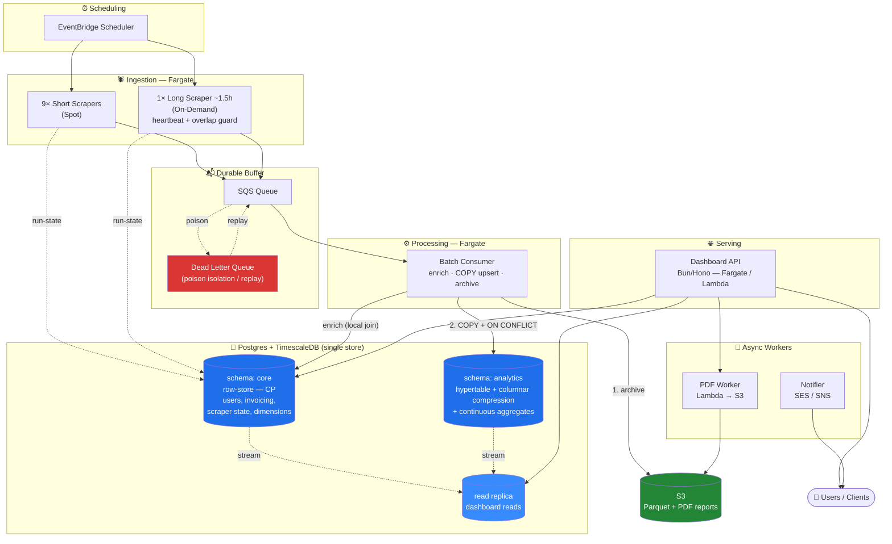
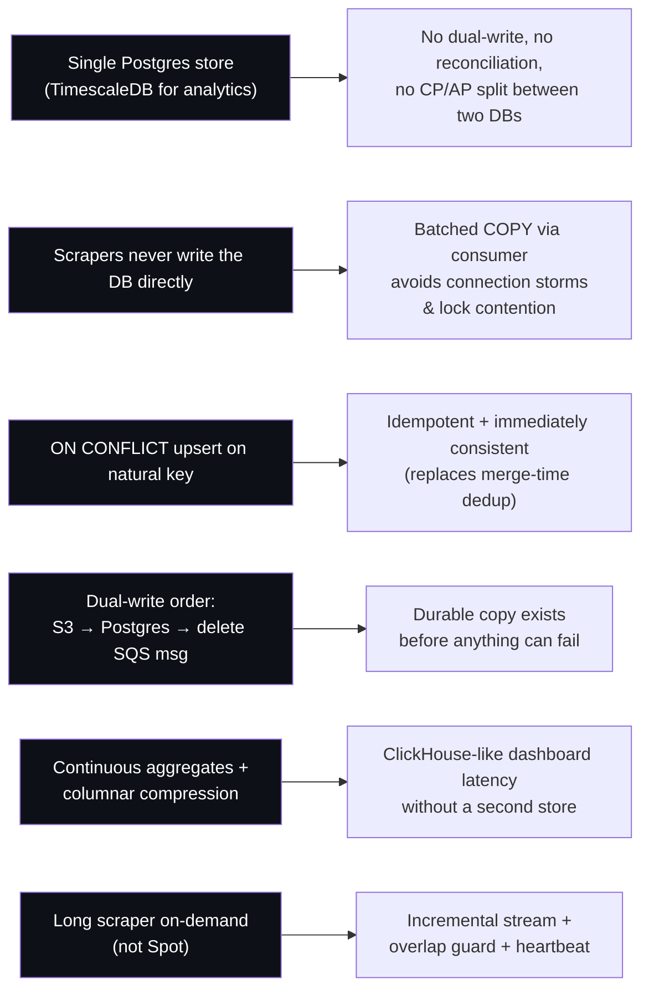
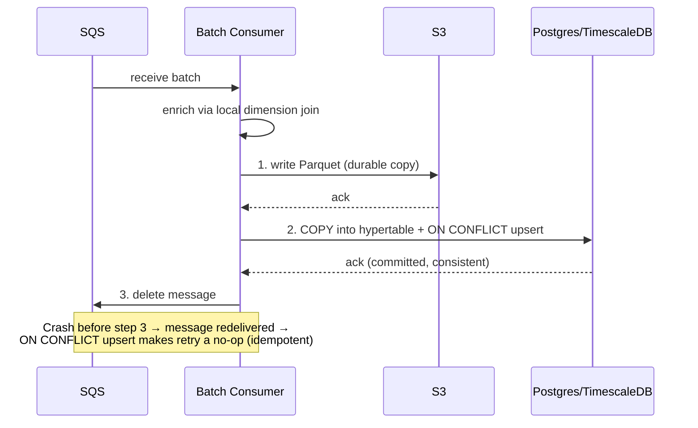
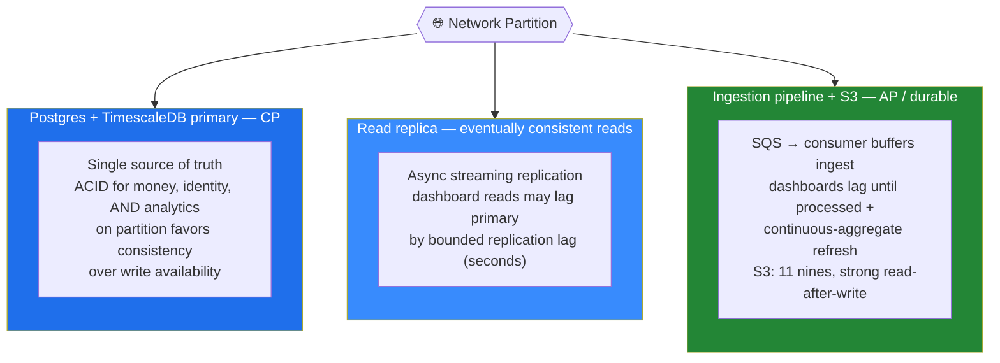
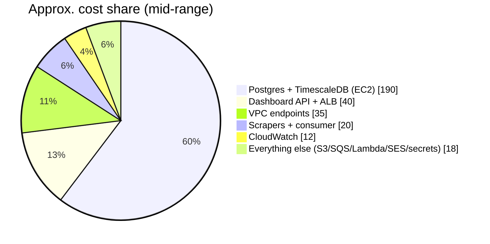
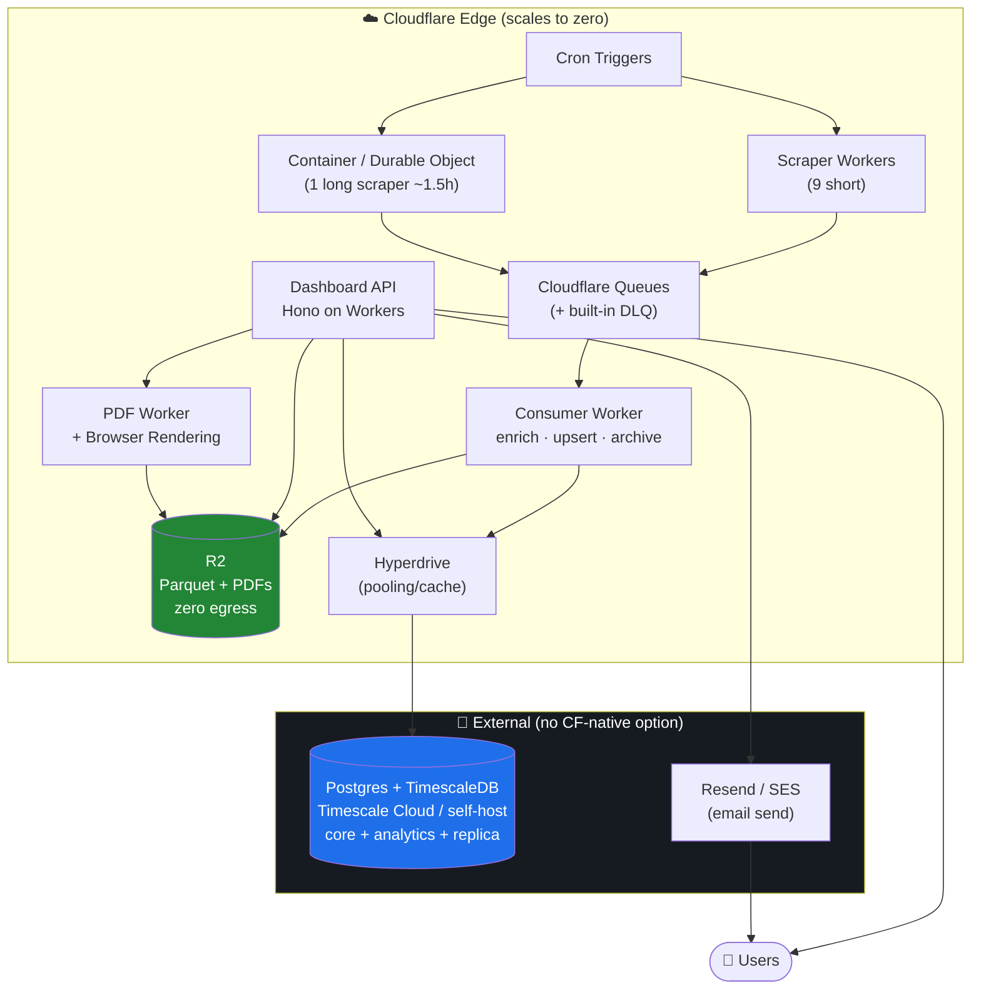

# MLS Platform — System Design

**Real-Estate Analytics & Reporting Platform**

A data-intensive platform ingesting **~100k records/day** from **10 MLS scrapers**. It runs on a **single strongly-consistent Postgres core** — transactional tables in a row-store schema, and analytics in a **TimescaleDB** schema (hypertables + columnar compression + continuous aggregates) — so one database serves both OLTP and OLAP.

> **Design change:** this revision **replaces the separate ClickHouse cluster with TimescaleDB inside Postgres.** The dual-store (Postgres + ClickHouse), the dual-write, the cross-store reconciliation job, and the CP/AP split between two databases are all eliminated. See [§2](#2-key-architecture-decisions) for the rationale.

---

## 1. High-Level Design

### Data Flow

```
EventBridge → Scrapers (Fargate) → SQS (+ DLQ) → Batch consumer → Postgres/TimescaleDB + S3 (Parquet)
Dashboard API → reads Postgres (core primary + analytics read replica) → Users
```

### Architecture Diagram



### Components

| Component | Role |
|-----------|------|
| **Ingestion** | 10 Fargate scrapers (9 short on **Spot**, 1 long ~1.5h **on-demand**). Triggered by EventBridge Scheduler. Stream rows to SQS; report run-state to Postgres. |
| **Queue** | SQS + DLQ. Durable buffer; poison messages isolated for replay. |
| **Processing** | Batch consumer (Fargate). Enriches rows from dimension tables (now a **local join** — same DB), bulk `COPY`s into the analytics hypertable with `ON CONFLICT` dedup, archives Parquet to S3. |
| **Data store** | **Postgres + TimescaleDB** (self-managed EC2 *or* Timescale Cloud). `core` schema = transactional (users, invoicing, scraper state, dimensions); `analytics` schema = hypertable with **columnar compression** + **continuous aggregates**. **Read replica** serves dashboard reads. |
| **Archive** | S3. Parquet (verification + replay) and generated PDF reports. |
| **Serving** | Bun/Hono Dashboard API (Fargate, or Lambda + RDS Proxy). Reads `core` on the primary, analytics rollups on the read replica. |
| **Async** | PDF worker (Lambda → S3); Notifier (SES/SNS) for client reminders. |
| **Ops** | Secrets Manager; VPC endpoints (no NAT); CloudWatch alarms (DLQ depth, **replication lag**, **continuous-aggregate refresh lag**). **No cross-store reconciliation needed** — one source of truth. |

---

## 2. Key Architecture Decisions



- **One database instead of two.** TimescaleDB gives Postgres columnar compression + auto-maintained rollups, so a single tuned instance serves both OLTP and OLAP. This **eliminates the dual-write, the Postgres↔ClickHouse reconciliation job, the merge-lag alarms, and the deliberate two-database CP/AP split.** Justified because at **~36M rows/year** a single Postgres easily serves analytics for years.
- **Scrapers never write the database directly** — batched `COPY` via the consumer avoids connection storms and lock contention, and keeps inserts efficient.
- **`ON CONFLICT (mls_id, listing_version) DO UPDATE`** makes ingestion idempotent and safely retryable — and unlike `ReplacingMergeTree`, dedup is **immediate and strongly consistent**, not resolved at a later merge.
- **Dual-write order: S3 → Postgres → delete SQS message** — a durable copy exists before anything can fail; a crash before the delete simply redelivers and the upsert absorbs it.
- **Dashboards read continuous aggregates off a read replica** — pre-rolled results, with analytical scan load isolated from the CP primary.
- **Hot chunk stays uncompressed (mutable) for upserts; older chunks compress to columnar on a schedule** — recent data is writable, historical data is small and scan-fast.
- **Long scraper runs on-demand (not Spot)** — streams incrementally, with an overlap guard and heartbeat.

### Dual-Write Sequence



> **Hosting note:** RDS/Aurora **cannot** run the TimescaleDB extension (locked allowlist). This design therefore runs Postgres **self-managed on EC2** or on **Timescale Cloud**. If staying on vanilla RDS/Aurora is a hard requirement, fall back to the **native path** — declarative partitioning + BRIN indexes + materialized views — which is viable at this row count without any extension.

---

## 3. CAP Theorem

With a single Postgres store, the system is now **predominantly CP** — one strongly-consistent source of truth. Eventual consistency is confined to two bounded, deliberate surfaces.



| Surface | Choice | Rationale |
|---------|--------|-----------|
| **Postgres/TimescaleDB primary** | **CP** | ACID for money, identity, **and analytics** in one place. On partition the single primary favors consistency over write availability. |
| **Read replica (dashboard reads)** | **AP-on-reads** | Async streaming replication; reads stay available during primary stress but may lag by a bounded replication delay (typically seconds). |
| **Ingestion pipeline (SQS → consumer) + S3** | **AP + durable** | The queue absorbs ingest; analytics is fresh only after the consumer commits and continuous aggregates refresh. S3: highly available, strong read-after-write, 11 nines durability. |

**Net:** the old "two databases with opposite CP/AP choices" collapses into **one CP system of record**, with eventual consistency limited to (a) ingestion lag through the queue and (b) read-replica lag. Simpler to reason about, and analytics is now strongly consistent at the primary.

---

## 4. Cost Estimate

Sized for the **target operating point**:

- **10–50 concurrent dashboard users**
- **Scrapers run once per day**, ingesting **10k–50k records/day** (~3.6M–18M rows/year)

> **Assumptions:** AWS `us-east-1`, on-demand pricing (no Reserved Instances or Savings Plans), Postgres + TimescaleDB **self-managed on EC2** with an **optional read replica** (RDS can't run TimescaleDB), Dashboard API on **Fargate behind an ALB** with 2 small tasks. All figures are USD/month and rounded.

### Monthly cost by component

| Component | Compute / config | Low | High | Notes |
|-----------|------------------|----:|-----:|-------|
| **Scrapers — Fargate** | 9× short on **Spot** + 1× long ~1.5h **On-Demand**, once/day | $5 | $15 | Runs minutes–hours/day, not 24/7. Spot makes the 9 short ones nearly free. |
| **Batch consumer — Fargate** | small task, processes daily batch | $5 | $20 | 10–50k records is tiny; cost is "time running," not volume. |
| **Dashboard API — Fargate + ALB** | 2× ~0.5 vCPU/1GB tasks, always-on, + ALB | $20 | $60 | ALB ~$16–20 is most of the floor. 10–50 users is light load. |
| **Postgres + TimescaleDB — EC2** | 1× `m6i.xlarge` primary (+ optional `m6i.large` read replica) + EBS gp3 | $130 | $280 | **Single biggest line, and now the only data store.** See [sizing](#postgres--timescaledb-sizing) below. Read replica ≈ +$70–90. |
| **S3** | Parquet archive + PDFs | $1 | $8 | A few GB/year compressed. Storage + requests are trivial at this volume. |
| **SQS + DLQ** | 0.3M–1.5M msgs/month | $0 | $2 | First 1M requests/month free; effectively free here. |
| **Lambda** | PDF worker + Notifier triggers | $1 | $5 | Low invocation count; often within free tier. |
| **SES / SNS** | client reminder emails / SMS | $1 | $10 | Email ~$0.10/1k; SMS is the variable — depends on volume/region. |
| **EventBridge Scheduler** | ~10 triggers/day | $0 | $1 | Negligible. |
| **Secrets Manager** | ~5–10 secrets | $2 | $5 | $0.40/secret/month + API calls. |
| **VPC interface endpoints** | ECR, SQS, Secrets, CloudWatch… (no NAT) | $15 | $70 | ~$7.3/endpoint/AZ. The deliberate trade vs a NAT Gateway. Single-AZ halves it. |
| **CloudWatch** | logs, metrics, alarms (DLQ depth, replication lag, cagg refresh) | $5 | $20 | Scales with log retention/verbosity. |
| **Data transfer** | egress to users (dashboard, PDFs) | $1 | $10 | Mostly internal/in-AZ; user egress is modest. |
| **Total** | | **≈ $185** | **≈ $505** | Realistic mid-point **≈ $270–400/month**. |

> **vs the ClickHouse design:** two data stores (Postgres Multi-AZ $50–120 **+** ClickHouse EC2 $125–145) collapse into one Postgres+TimescaleDB line ($130–280). The dollar change is a modest wash-to-saving — **the real win is operational**: one database, no dual-write, no reconciliation job, fewer alarms, and strongly-consistent analytics.

### Reading the numbers



- **The bill is "the database + always-on edges," not data volume.** The single Postgres+TimescaleDB instance is ~60–70% of cost, and it costs the same whether you ingest 10k or 50k records/day. Ingestion itself (scrapers, SQS, consumer, S3) stays **under ~$30/month combined**.
- **This realizes §2's thesis directly:** one tuned Postgres serves analytics for years at this scale — so paying for a second columnar cluster was buying capacity you don't yet need.
- **VPC interface endpoints remain a quiet line item** (~$15–70) — the cost of the "no NAT" decision.

### Postgres + TimescaleDB sizing

The instance now carries **both** the transactional load **and** analytics, and OLAP work is memory-hungry — so favor RAM. The 1:4 vCPU:RAM ratio (the `m`/`r` families) is the right shape. Pricing in `us-east-1`, on-demand, 730 hrs/month:

| Instance | vCPU / RAM | $/hr | Compute/mo | Role |
|----------|-----------|-----:|-----------:|------|
| `m6i.large` | 2 / 8 GB | $0.096 | ~$70 | Read replica (serves pre-rolled aggregates) |
| `m6i.xlarge` ⭐ | 4 / 16 GB | $0.192 | ~$140 | **Recommended primary minimum** — handles OLTP + TimescaleDB analytics |
| `r6i.xlarge` | 4 / **32 GB** | $0.252 | ~$184 | Primary with OLAP headroom (large aggregations, more concurrency) |
| `r6i.2xlarge` | 8 / 64 GB | $0.504 | ~$368 | Only if dashboards get heavy or data grows past plan |

Plus required **EBS gp3** at $0.08/GB-month (TimescaleDB columnar compression keeps this small — typically ~90% smaller than raw): 100 GB → +$8, 200 GB → +$16.

**All-in:**

| Topology | Monthly (compute + EBS) |
|----------|------------------------:|
| Primary only (`m6i.xlarge` + 200 GB) | **~$156** |
| Primary + read replica (`m6i.xlarge` + `m6i.large`) | **~$234** |
| 1-yr Savings Plan (~37% off compute) | **−$50–90** off the above |
| Managed alternative — **Timescale Cloud** (HA + replica) | **~$130–350** depending on size |

> **Why the read replica:** at 10–50 users you *can* run primary-only and skip it (~$80/mo cheaper), but a replica isolates analytical scans from the money/identity workload and gives read-side HA. It's the single best ~$80/mo you can spend here.

---

## 5. Alternative: Cloudflare Infrastructure

The same architecture re-platformed onto **Cloudflare Workers**. The model is fundamentally different from AWS: almost everything is **serverless, edge-distributed, and scales to zero** — which flips the cost structure. But with a single-Postgres design, **the heart of the system (Postgres + TimescaleDB) has no first-party Cloudflare equivalent**, so it must stay external. That means Cloudflare contributes the *edge/ingest/serving* tier, not the database.

### Service mapping (AWS → Cloudflare)

| AWS component | Cloudflare equivalent | Fit |
|---------------|----------------------|-----|
| EventBridge Scheduler | **Cron Triggers** (on a Worker) | ✅ Clean |
| Short scrapers (Fargate Spot) | **Workers** | ⚠️ Workers cap CPU time (≤5 min); fine for short scrapes |
| Long scraper ~1.5h | **Cloudflare Containers** (or chunked **Durable Object** alarms) | ⚠️ Doesn't fit the Workers model — needs Containers or DO-alarm chunks |
| SQS + DLQ | **Cloudflare Queues** (built-in DLQ/retries) | ✅ Clean |
| Batch consumer (Fargate) | **Workers** (Queue consumer, batched) | ✅ Clean |
| **Postgres + TimescaleDB** | **No native Postgres / no TimescaleDB.** External (Timescale Cloud / self-host) via **Hyperdrive** pooling | ❌ The whole data store is external. D1 (SQLite) has **no hypertables, columnar, or continuous aggregates** |
| S3 | **R2** (S3-compatible, **zero egress fees**) | ✅ Better — no egress cost |
| Dashboard API (Bun/Hono) | **Workers** — **Hono runs natively on Workers** | ✅ Excellent — same framework, no rewrite |
| PDF worker (Lambda) | **Workers + Browser Rendering API** | ✅ Clean |
| Notifier (SES/SNS) | **Email Routing** (inbound) + external send (Resend/SES) | ⚠️ No native bulk email send |
| Secrets Manager | **Workers Secrets / Secrets Store** | ✅ Clean |
| VPC endpoints / NAT | **N/A** — no VPC; Workers run on the edge | ✅ Cost eliminated |
| CloudWatch | **Workers Analytics + Logpush + Tail Workers** | ✅ Clean |

### Architecture on Cloudflare



### Cost comparison

Two Cloudflare variants, same workload (10–50 users, once-daily ingest of 10–50k records). All USD/month.

| Component | AWS (from §4) | **CF-native** (D1 only) | **CF + external Timescale** (faithful) |
|-----------|--------------:|------------------------:|---------------------------------------:|
| Compute (API + scrapers + consumer + PDF) | $30–95 | **$5** Workers Paid base¹ | **$5** Workers Paid base¹ |
| Long-scraper runtime | (in above) | $5–15 Containers | $5–15 Containers |
| Queue | $0–2 | $0–1 Queues | $0–1 Queues |
| Object storage | $1–8 | $1–3 R2 (no egress) | $1–3 R2 (no egress) |
| **Data store (txn + OLAP)** | $130–280 PG+Timescale | $0–10 D1 ⚠️ **no Timescale/OLAP** | $130–350 Timescale Cloud / self-host + Hyperdrive (free) |
| Email | $1–10 | $0–20 Resend/SES | $0–20 Resend/SES |
| Secrets / observability | $7–25 | $0–3 (mostly included) | $0–3 (mostly included) |
| VPC endpoints / NAT / ALB | $35–130 | **$0** (no VPC, no LB) | **$0** |
| **Total** | **≈ $270–400** | **≈ $15–55/month** ⚠️ | **≈ $145–390/month** |

¹ Workers Paid is $5/mo and includes 10M requests + 30M CPU-ms — far above this workload, so all Worker-based components share that one base fee.

### Trade-offs

**Where Cloudflare wins**
- **No VPC/NAT/endpoint/ALB tax** — eliminates $35–130/mo of pure AWS plumbing.
- **R2 zero egress** — meaningful once dashboards/PDFs are served at volume.
- **Hono runs unchanged on Workers** — the Dashboard API ports with little to no rewrite.
- **Edge tier scales to zero** — ingest/serving cost ~nothing when idle.

**Where Cloudflare hurts (more than in the ClickHouse design)**
- **The data store — now the entire heart of the system — has no Cloudflare equivalent.** With a single-Postgres design there's no "second store to relocate"; the one store that matters is Postgres + TimescaleDB, and it must live on **Timescale Cloud or self-host**. Cloudflare can only front it via **Hyperdrive**.
- **CF-native (D1) is a real downgrade, not a port.** D1 is SQLite — **no hypertables, no columnar compression, no continuous aggregates**. It only works if "analytics" stays trivial; you lose the exact features that justified TimescaleDB.
- **Long-running scrapers fight the Workers model** — the 1.5h job needs **Containers** or **Durable Object alarm chunks** with the heartbeat/overlap-guard logic rebuilt.

### Verdict

- **The single-Postgres decision moves the center of gravity to the database**, and Cloudflare doesn't host it. So Cloudflare is best read as an **edge/compute layer in front of an external Postgres + TimescaleDB** (~$145–390/mo): you shed the VPC/NAT/ALB tax and gain R2 zero-egress and a native Hono runtime, but the database (and most of the cost) lives elsewhere on Timescale Cloud or a self-managed host.
- **The cheap CF-native path (~$15–55, D1) is only honest if your analytics never outgrows SQLite** — which contradicts choosing TimescaleDB in the first place. Don't pick it unless you're consciously dropping the OLAP requirement.
- **Net:** versus the old ClickHouse design, Cloudflare's dramatic savings shrink — because we already collapsed two stores into one, there's no second store for Cloudflare to make disappear. Use Cloudflare here for the **edge/ingest/serving tier**; keep **Postgres + TimescaleDB** on the platform that runs it best (self-managed EC2, or Timescale Cloud).

> **Pricing note:** Cloudflare figures use public list pricing (Workers Paid $5/mo base, Queues ~$0.40/M ops, R2 $0.015/GB + $0 egress, D1 within included tiers at this volume). Containers and Browser Rendering bill per resource-second/request and are estimated at low daily usage. External Postgres/TimescaleDB/email are third-party list prices.
